# What is this?
This repo is a Trello clone built with VueJS. I decided to make this app over a free weekend of mine as a way to learn VueJS. Since I built the app purely as an exercise over the span of 48 hours it is not fully-functional or bug-free. The purpose of this project was to create an application that met the minimum requirements listed below. Each requirement was created to achieve a specific learning goal.

1. There are two views--one that displays the collection of board and another that displays the lists and cards for a given board (Vue router)
2. The app uses components to modularize the code (Vue components)
3. Both cards and lists are draggable (Vue directives)
4. Local storage is used and continuously updated to synchronize data across components (Vue watch/data binding)
5. You can create and edit cards, card descriptions, lists, and boards (Vue events)
6. You can "star" your most important boards and see the filtered subset at the top of the board collection page (Vue filters)

# Connect with me

If you'd like to collaborate on a project, learn more about me, or just say hi, feel free to contact me using any of the social channels listed below.

- [Personal Website](https://zackthoutt.com)
- [Email](mailto:zackarey.thoutt@colorado.edu)
- [LinkedIn](https://www.linkedin.com/in/zack-thoutt-57275655/)
- [Twitter](https://twitter.com/zthoutt)
- [Medium](https://medium.com/@zthoutt)
- [Quora](https://www.quora.com/profile/Zack-Thoutt)
- [HackerNews](https://news.ycombinator.com/submitted?id=zthoutt)
- [Reddit](https://www.reddit.com/user/zthoutt/)
- [Kaggle](https://www.kaggle.com/zynicide)
- [Instagram](https://www.instagram.com/zthoutt/)
- [500px](https://500px.com/zthoutt)

# Demo
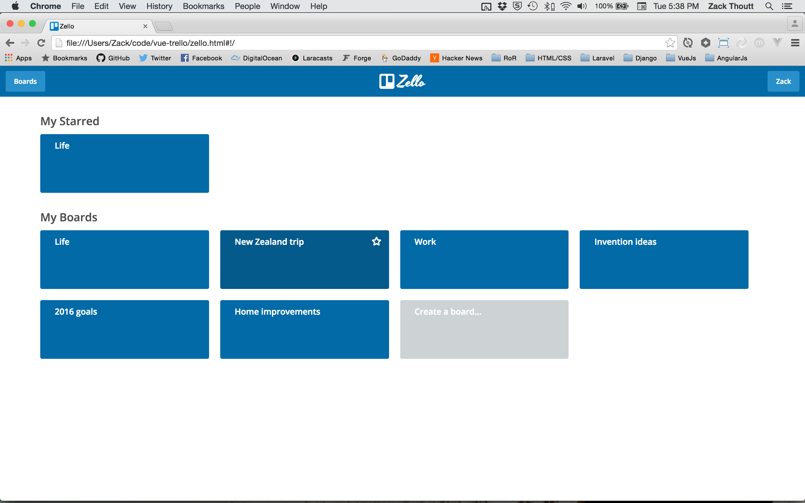

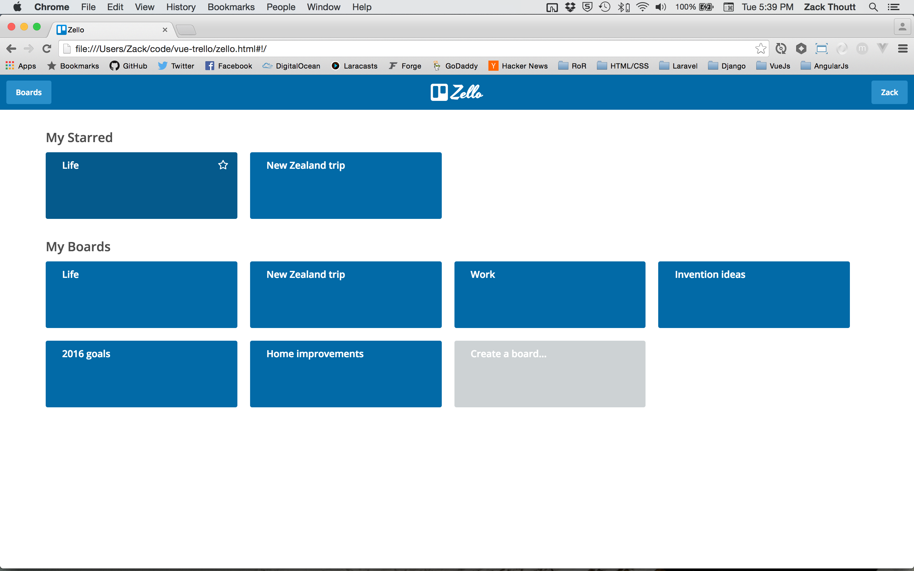
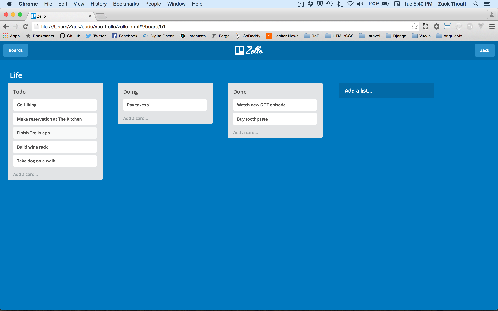

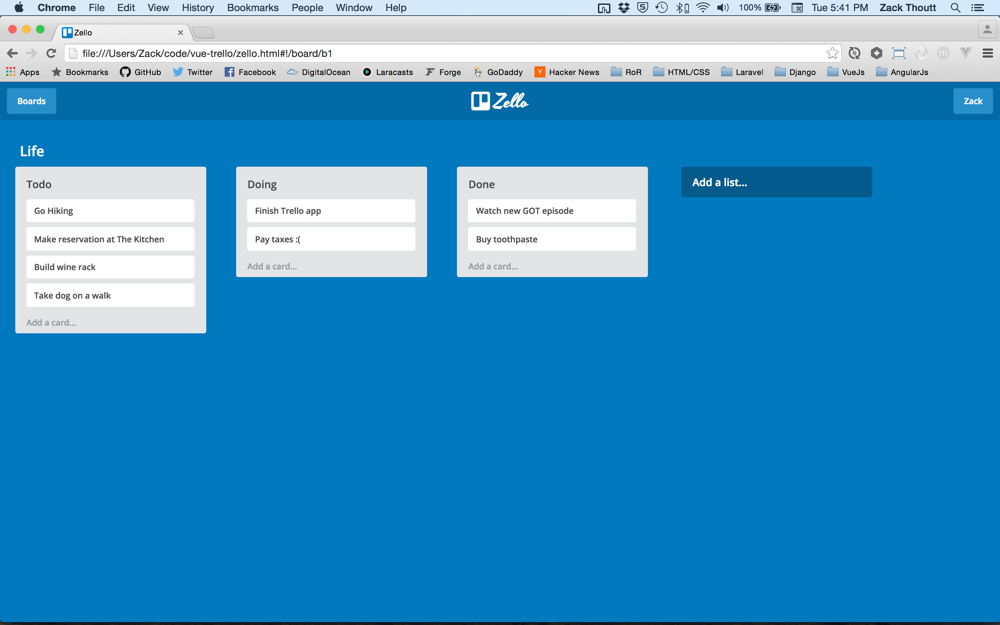

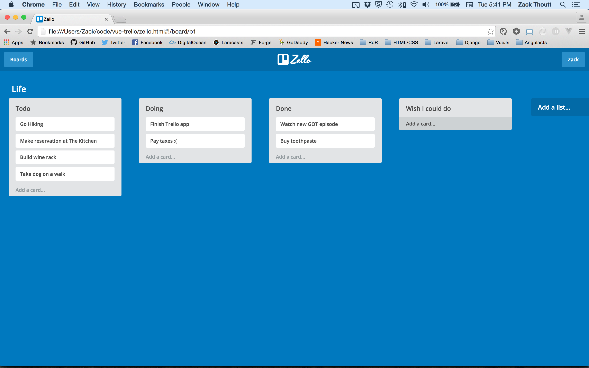
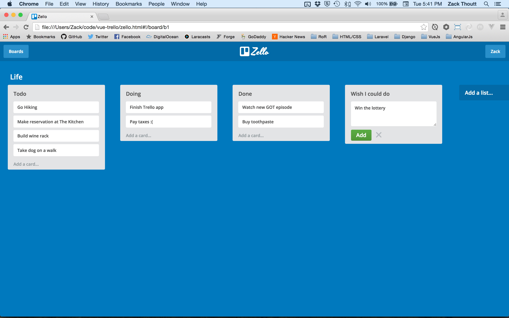
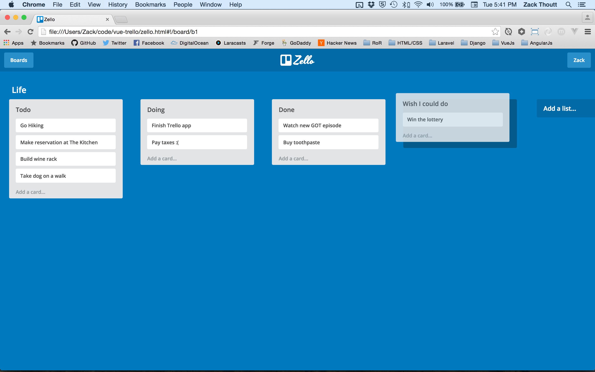
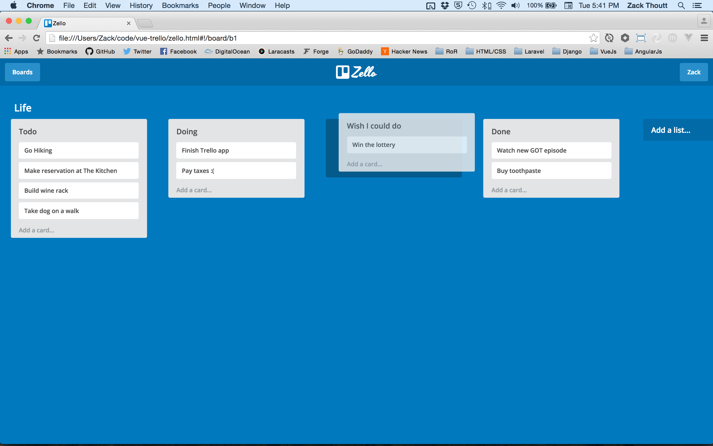
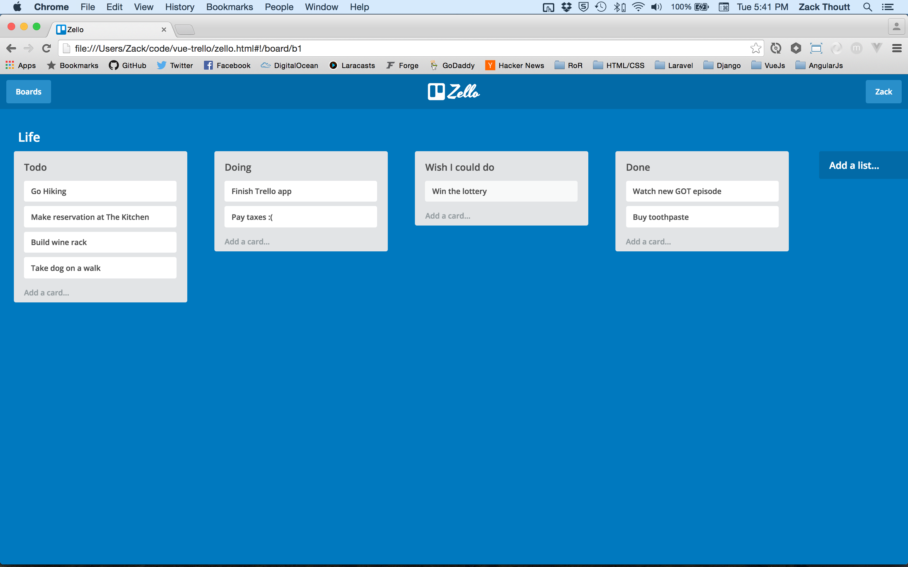
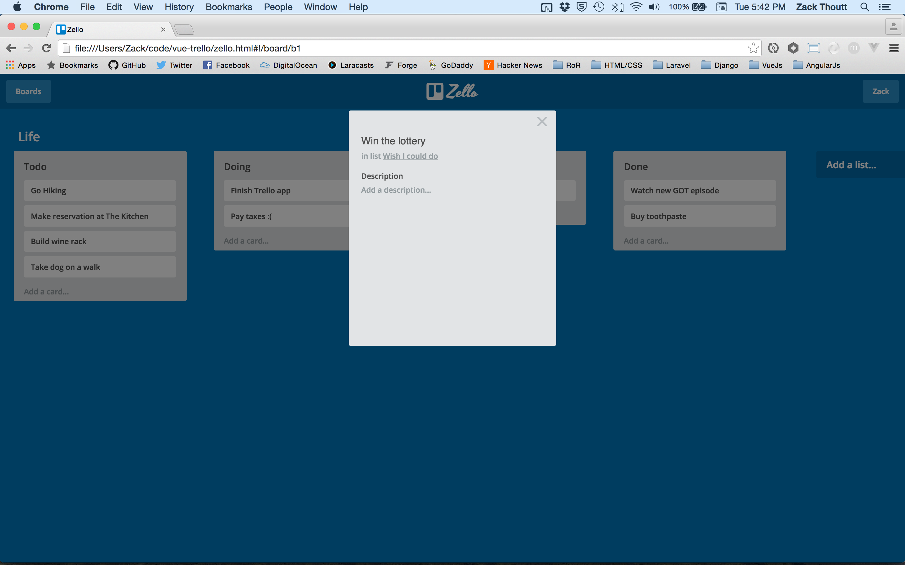

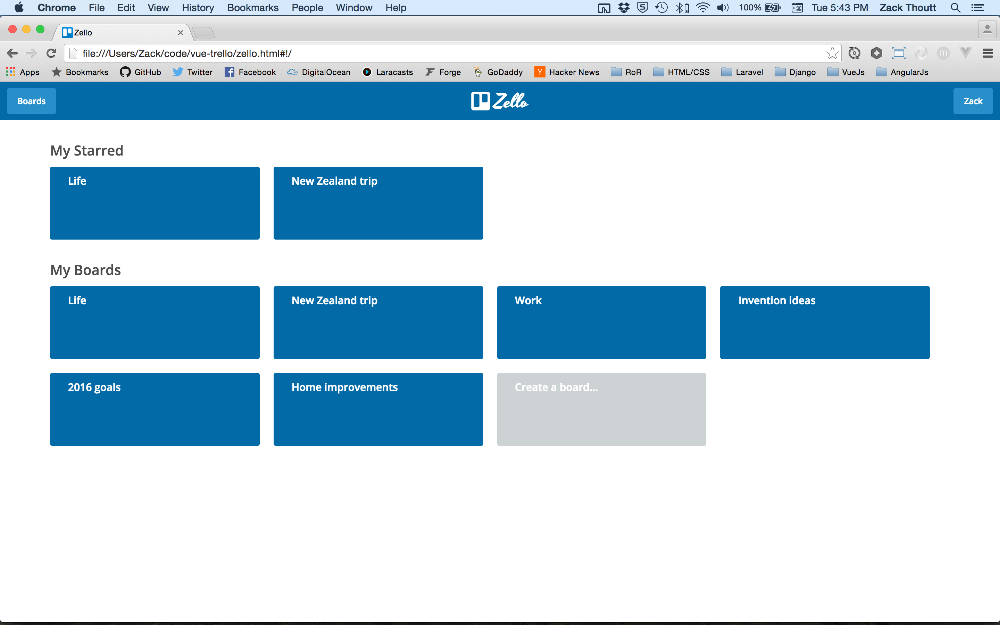

